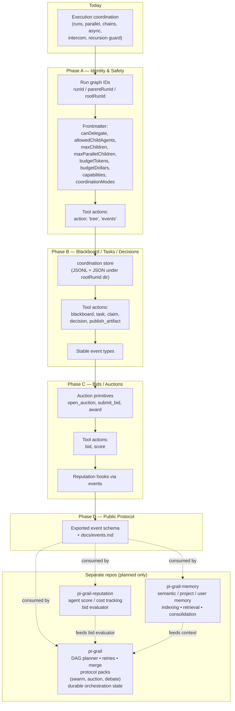

# Evolve pi-subagents into a coordination kernel; spec Grail as a separate package

## Context

Today this fork of `pi-subagents` is already a strong child-agent **execution** layer: single/parallel/chain modes, async background runs, intercom bridge to the parent, recursion-depth guard, session/artifact capture, and clarification TUI. What is missing — and what `ultraplan-args.md` argues for — is the **coordination substrate** sitting between raw execution and a higher-level orchestrator: explicit run graph identity, structured event log, run-local blackboard / task board, claims/bids, delegation safety, and budgets. With that substrate in place, an opinionated orchestrator (`pi-grail`) can be built as a separate package without forking the runtime.

This plan is **design-only**. No code changes in this session. It locks in:
1. A phased evolution of pi-subagents (A → B → C → D) so each phase ships behind additive APIs.
2. A spec for the `pi-grail` package, planned to live in a separate repo. FORK.md already commits to that split; this plan does not modify the repo layout here.

## Shape of the change



The runtime stays additive: existing `subagent({ agent, task })` calls keep working. New capabilities arrive as new `action:` values and new frontmatter fields with safe defaults.

## Phase A — Identity and delegation safety

Goal: make hierarchy explicit and enforceable. No new tool surface for coordination yet; just plumbing + safety.

### A.1 Run graph identity

Today every event carries `runId` (e.g. `subagent.step.started` in `src/runs/background/subagent-runner.ts`). Child Pi processes already get `PI_SUBAGENT_RUN_ID` via `src/runs/shared/pi-args.ts:11`. Extend that env contract:

- Add `PI_SUBAGENT_PARENT_RUN_ID` and `PI_SUBAGENT_ROOT_RUN_ID` constants and env propagation in `src/runs/shared/pi-args.ts` (next to `SUBAGENT_RUN_ID_ENV`).
- In `buildPiArgs` (`src/runs/shared/pi-args.ts:51`), thread both: child's `parentRunId` = current process's `runId`, `rootRunId` = `process.env.PI_SUBAGENT_ROOT_RUN_ID ?? options.runId`.
- Stamp every event written via `appendJsonl(eventsPath, …)` (see `src/runs/background/subagent-runner.ts:250` and call sites) with `{ runId, parentRunId, rootRunId, agent, index }`. Centralize via a small `buildEventEnvelope(ctx)` helper in a new `src/runs/shared/event-envelope.ts` to avoid sprinkling the fields.
- In `src/shared/types.ts`, extend `ControlEvent`, `AsyncStartedEvent`, `AsyncStatus`, `AsyncJobState` with optional `parentRunId?: string; rootRunId?: string`.
- Foreground path: `src/runs/foreground/execution.ts:318` and `:345` build `ControlEvent` literals — wire `parentRunId/rootRunId` through `RunSyncOptions` (extend the interface in `src/shared/types.ts:454`) and `createSubagentExecutor` (`src/runs/foreground/subagent-executor.ts`).

### A.2 `action: "tree"` and `action: "events"`

Add two read-only inspection actions:

- `subagent({ action: "tree", id? })` — walks every async-run directory under `ASYNC_DIR` (`src/shared/types.ts:585`), groups by `rootRunId`, renders a hierarchical tree. Reuse `listAsyncRuns` and `resolveAsyncRunLocation` (`src/runs/background/async-status.ts`, `async-resume.ts`).
- `subagent({ action: "events", id })` — streams the JSONL `events.jsonl` of an async run (or all runs sharing a `rootRunId`), optionally filtered by `type:` prefix.

Wire both:
- `SUBAGENT_ACTIONS` constant in `src/shared/types.ts:598` — add `"tree", "events"`.
- `SubagentParams` in `src/extension/schemas.ts:101` — already accepts `action` + `id`; add nothing new there.
- Dispatch in `createSubagentExecutor` (handler that runs `inspectSubagentStatus` for `action: "status"`) — add `inspectSubagentTree` and `inspectSubagentEvents` siblings in `src/runs/background/`.

### A.3 Delegation safety in frontmatter

Extend `loadAgentsFromDir` (`src/agents/agents.ts:544`) and the `AgentConfig` interface (`src/agents/agents.ts:70`). Parse the following frontmatter fields; all optional:

- `canDelegate: boolean` — default `false` for every builtin except `delegate`, which gets `true`.
- `allowedChildAgents: string` — comma-separated list of names (matches existing `tools:`, `skills:` shape).
- `maxChildren: integer` — total spawned children across the whole run.
- `maxParallelChildren: integer` — concurrent children at any time.
- `budgetTokens: integer`, `budgetDollars: number` — root-run budget caps.
- `capabilities: string` — comma-separated tags (e.g. `code_review,auth`).
- `coordinationModes: string` — comma-separated subset of `blackboard,auction,vote,debate` (defaults to none in Phase A; enforced in Phase B/C).
- `allowedCoordinationActions: string` — comma-separated subset of `ask_supervisor,publish_artifact,record_finding,record_decision,post_task,claim,submit_bid,score`.

Update `KNOWN_FIELDS` (`src/agents/agent-serializer.ts`) so these no longer fall into `extraFields`. Extend `frontmatterNameForConfig` / serializer to round-trip them in `subagent({ action: "create" | "update" })`.

Enforcement (still Phase A):
- New helper `src/runs/shared/delegation-guard.ts` that reads `PI_SUBAGENT_PARENT_AGENT` (new env, set by `buildPiArgs`) and the parent's `AgentConfig`, and rejects the spawn if `canDelegate !== true` or the child isn't in `allowedChildAgents`.
- Counters: per-`rootRunId` JSON file under `ASYNC_DIR/<rootRunId>/coord/limits.json` tracks `childCount` and `parallelChildCount`. Increment on spawn, decrement on close. Reuse `writeAtomicJson` (`src/shared/atomic-json.ts`).
- Budget gate: pre-spawn check sums token usage from `events.jsonl` for the `rootRunId`. Reuse `tokenUsageFromAttempts` pattern (`src/runs/background/subagent-runner.ts:133`).

### A.4 Phase A files (modify)

```
src/shared/types.ts                       # add parent/root IDs to events; extend frontmatter types
src/runs/shared/pi-args.ts                # env propagation for parent/root run IDs + parent agent name
src/runs/shared/event-envelope.ts         # NEW — single helper to stamp event envelopes
src/runs/shared/delegation-guard.ts       # NEW — enforce canDelegate / allowedChildAgents / budgets
src/runs/foreground/execution.ts          # use envelope; carry parentRunId/rootRunId
src/runs/foreground/subagent-executor.ts  # call delegation-guard before spawn
src/runs/background/subagent-runner.ts    # use envelope; carry parentRunId/rootRunId
src/agents/agents.ts                      # parse new frontmatter fields
src/agents/agent-serializer.ts            # KNOWN_FIELDS + round-trip serializer
src/extension/schemas.ts                  # add 'tree', 'events' to SUBAGENT_ACTIONS via types.ts
src/runs/background/inspect-tree.ts       # NEW — derive run graph from ASYNC_DIR
src/runs/background/inspect-events.ts     # NEW — stream events.jsonl with filters
src/extension/index.ts                    # dispatch new actions
```

## Phase B — Blackboard, task board, decisions

Goal: run-scoped coordination state and a structured event log that protocols (in Grail or downstream) can build on.

### B.1 Coordination store

Per `rootRunId`, create `ASYNC_DIR/<rootRunId>/coord/`. Reuse existing JSONL utilities (`appendJsonl` in `src/shared/artifacts.ts:39`, `writeAtomicJson` in `src/shared/atomic-json.ts`, `createJsonlWriter` in `src/shared/jsonl-writer.ts`). Layout:

```
coord/
  blackboard.jsonl       # append-only key/value/append records
  tasks.jsonl            # task lifecycle (post/claim/release/complete)
  findings.jsonl         # findings linked to a taskId
  decisions.jsonl        # decision log
  artifacts.jsonl        # artifact index (path, runId, agent, summary)
  limits.json            # counters from Phase A
```

Add `src/coordination/store.ts` with a narrow API:

```
appendBlackboard(rootRunId, scope, key, value, meta)
getBlackboard(rootRunId, scope, key)
listBlackboard(rootRunId, scope?, keyPrefix?)
postTask(rootRunId, task)
claimTask(rootRunId, taskId, agent, runId)
releaseTask(rootRunId, taskId, agent, runId, reason)
recordFinding(rootRunId, finding)
recordDecision(rootRunId, decision)
publishArtifact(rootRunId, artifact)
```

Concurrency: tasks/claims use atomic compare-and-set via `writeAtomicJson` on a per-task `tasks/<id>.json` shadow file; the JSONL is the append-only audit log.

### B.2 Tool surface (additive)

Extend `SubagentParams` (`src/extension/schemas.ts:101`) with a `coordination` object so the existing flat shape stays clean:

```ts
{
  action: "coordination",
  coord: {
    op: "blackboard.append" | "blackboard.get" | "blackboard.list"
      | "task.post" | "task.claim" | "task.release" | "task.complete" | "task.list"
      | "decision.record" | "decision.list"
      | "artifact.publish" | "artifact.list"
      | "finding.publish" | "finding.list",
    rootRunId?: string,    // defaults to env PI_SUBAGENT_ROOT_RUN_ID
    scope?: string,        // namespace within blackboard ("findings", "open_questions", ...)
    key?: string,
    value?: unknown,
    taskId?: string,
    task?: { title: string; requiredCapabilities?: string[]; reward?: number; deadlineMs?: number; ... },
    finding?: { summary: string; evidence?: string[]; confidence?: number; taskId?: string },
    decision?: { topic: string; choice: string; rationale?: string; alternatives?: string[] },
    artifact?: { path: string; summary?: string; tags?: string[] }
  }
}
```

Action dispatch lives in a new `src/coordination/actions.ts`; wired in `src/extension/index.ts` alongside the existing management/control branches in `executeSubagentCollapsed`.

Per-agent enforcement reuses Phase A's `allowedCoordinationActions` frontmatter: an agent without `allowedCoordinationActions: post_task` cannot call `task.post`. Failures return a structured tool error, never silent.

### B.3 Stable event types

Centralize in `src/coordination/event-types.ts` (exported for downstream packages):

```
task.posted          task.claimed         task.released         task.completed
finding.published    decision.recorded    artifact.published
question.asked       question.answered    child.blocked         child.resumed
result.submitted     status.changed
```

Every coordination op appends a JSONL record (using `event-envelope.ts` from Phase A) to the same `events.jsonl` already used by the runner. That gives a single, ordered, replayable stream per `rootRunId`.

### B.4 contact_supervisor → coordination

`contact_supervisor` already exists (see `src/intercom/intercom-bridge.ts`). In Phase B, also mirror its calls as events:
- `reason: "need_decision"` → emit `question.asked`
- supervisor reply → emit `question.answered`
- `reason: "progress_update"` → emit `status.changed`

No change to the tool signature; just an additional `appendJsonl` next to the existing intercom wiring. This makes intercom interactions visible in the same event stream Grail will read.

### B.5 Phase B files (modify or new)

```
src/coordination/store.ts          # NEW — JSONL+JSON-backed coordination store
src/coordination/actions.ts        # NEW — dispatch for coord ops; uses store + envelope
src/coordination/event-types.ts    # NEW — exported event type constants
src/extension/schemas.ts           # add 'coordination' action + coord object
src/extension/index.ts             # wire coordination dispatch
src/intercom/intercom-bridge.ts    # also append question.asked/answered events
src/shared/types.ts                # SUBAGENT_ACTIONS += 'coordination'
agents/aggregator.md               # NEW builtin — reads blackboard, summarizes findings
```

## Phase C — Bids / auctions

Goal: contract-net / market-based allocation primitives. Same store backend, distinct ops.

Add `op: "auction.open" | "auction.bid" | "auction.award" | "auction.close" | "score.record"` and `coord: { auctionId?, bid?, winners?, score? }` to the `coordination` action.

Per-auction state under `ASYNC_DIR/<rootRunId>/coord/auctions/<id>.json` (compare-and-set writes). Events: `auction.opened, bid.submitted, auction.closed, bid.won, bid.failed, agent.result.scored`.

Reputation is **out of scope** for this repo. Phase C only emits the events; a downstream package (or Grail) can subscribe and maintain reputation state. Document this contract in `src/coordination/event-types.ts`.

### Phase C files

```
src/coordination/auctions.ts       # NEW — auction lifecycle + bid evaluation helpers
src/coordination/actions.ts        # extend dispatch for auction/score ops
src/coordination/event-types.ts    # extend with auction/bid/score event names
src/extension/schemas.ts           # coord.auctionId / coord.bid / coord.winners / coord.score
```

## Phase D — Public protocol

- Export `event-types.ts` as a public entry point (add to `package.json#files` and reference via README).
- Add `docs/events.md` documenting every event type's shape (parentRunId/rootRunId/agent/index/payload).
- Update `README.md` and `CHANGELOG.md` to call out the coordination kernel surface.
- Add an `extension` API: `pi.events.on(SUBAGENT_COORDINATION_EVENT, …)` to let other Pi packages subscribe in-process without scraping JSONL. Mirror existing `SUBAGENT_ASYNC_COMPLETE_EVENT` wiring in `src/extension/index.ts`.

No frontmatter or behavior changes in this phase — just stabilizing the surface for `pi-grail` and the memory package.

## Grail and siblings — separate repos, spec only

Three packages live downstream of this kernel. None are added to this repo. FORK.md already states pi-subagents stays focused on the child runtime; orchestration, memory, and reputation each own their domain.

### pi-grail — orchestrator

```
pi-grail/
  package.json                  # peerDeps: pi-subagents
  src/
    extension/index.ts          # registers grail tool; subscribes to pi-subagents events
    dag/planner.ts              # goal → task DAG
    dag/scheduler.ts            # topo order, retries, merge gates
    protocols/                  # protocol packs (each is a planner-of-planners)
      planner-worker-reviewer.ts
      swarm-review.ts
      auction-debug.ts
      committee-vote.ts
      debate-tournament.ts
    policy/
      retries.ts                # retry/backoff policy
      merge.ts                  # output merge / acceptance gates
      assignment.ts             # capability-based agent selection (calls pi-grail-reputation)
    state/durable-store.ts      # workflow-level state (cross-session, opinionated)
    adapters/
      memory.ts                 # pluggable; binds to pi-grail-memory when installed
      reputation.ts             # pluggable; binds to pi-grail-reputation when installed
  slash/
    /swarm-review, /auction-debug, /committee-plan
```

### pi-grail-memory — semantic memory addon

Memory is complex enough to deserve its own package. It consumes the Phase D event stream and exposes a query API that Grail (or any orchestrator) can call.

```
pi-grail-memory/
  package.json                  # peerDeps: pi-subagents (events.jsonl is the input)
  src/
    extension/index.ts          # registers `memory` tool; subscribes to pi-subagents events
    consume/event-replay.ts     # ingest events.jsonl, decide what is worth remembering
    consume/extractors.ts       # findings, decisions, artifacts → memory candidates
    index/
      embeddings.ts             # provider-agnostic embedding adapter
      vector-store.ts           # local FAISS/SQLite vector store; pluggable backends
      keyword-index.ts          # fallback BM25 / sqlite FTS
    retrieve/
      query.ts                  # memory({ action: "recall", query, scope, k })
      inject.ts                 # produces context blocks for agents
    consolidate/
      summarize.ts              # background consolidation jobs
      forget.ts                 # TTL / decay / explicit forget
    scope/
      run.ts                    # run-local (mirrors pi-subagents coord store)
      project.ts                # per-project knowledge
      user.ts                   # user preferences
  tools/
    memory.ts                   # action: "remember" | "recall" | "forget" | "consolidate"
```

Contract: pi-subagents emits, pi-grail-memory decides what to keep. The kernel never embeds, indexes, or retrieves.

### pi-grail-reputation — agent score / cost tracking addon

Reputation is **not** out of scope for the architecture — only out of scope for the kernel. It lives in its own package because (a) scoring rules are opinionated, (b) it crosses run boundaries, (c) Grail's assignment policy depends on it.

```
pi-grail-reputation/
  package.json                  # peerDeps: pi-subagents (events.jsonl is the input)
  src/
    extension/index.ts          # registers `reputation` tool; subscribes to pi-subagents events
    consume/event-replay.ts     # bid.won / bid.failed / agent.result.scored / step.completed
    score/
      model.ts                  # per-(agent, capability) reputation model
      bayes.ts                  # default scoring (beta posterior over success)
      cost.ts                   # token/$ per task class
    store/durable.ts            # persisted across sessions (sqlite)
    query/
      rank.ts                   # reputation({ action: "rank", capability, candidates })
      stats.ts                  # reputation({ action: "stats", agent })
    feedback/
      explicit.ts               # human/parent score submissions
      derived.ts                # derived from completion guard, retry signals, etc.
  tools/
    reputation.ts               # action: "rank" | "stats" | "score" | "reset"
```

Grail's `policy/assignment.ts` and `protocols/auction-debug.ts` call `reputation({ action: "rank", ... })` before issuing `subagent({ ... })` calls. Without pi-grail-reputation installed, Grail's `adapters/reputation.ts` returns uniform scores and the system degrades gracefully.

### Boundary contract with pi-subagents

- All three downstream packages **read** pi-subagents output: `events.jsonl` (subscribed via `pi.events.on` in-process, or replayed from disk), coordination store directories, async run status files.
- They **write** pi-subagents inputs only by issuing `subagent({ ... })` tool calls — never reaching into runner internals.
- Pi-subagents stays unaware of all three. Multiple orchestrators can coexist on the same kernel.

### Implementation order across repos (rough)

1. Phase A + B ship in this repo. Stable event envelope and coordination store published.
2. `pi-grail` repo bootstrapped; `planner-worker-reviewer` protocol against Phase B primitives.
3. `pi-grail-memory` repo bootstrapped against Phase D event schema.
4. Phase C ships in this repo (auctions). `pi-grail-reputation` repo bootstrapped to consume `bid.*` / `agent.result.scored`.
5. `pi-grail` adds `swarm-review` and `auction-debug` protocols, wiring reputation + memory adapters.

This plan does **not** write a single line of code in any of those repos; it locks down the kernel's event/tool surface so they can be started independently.

## What lives outside this repo (planned, not deferred)

- **Durable semantic memory.** Lives in `pi-grail-memory` (spec'd above). Kernel emits the events it needs; kernel does not embed or index.
- **High-level planning policy** (DAG planners, retry/merge policy, acceptance gates, project workflows). Lives in `pi-grail`.
- **Reputation state.** Lives in `pi-grail-reputation` (spec'd above). Kernel emits `bid.*` and `agent.result.scored` so the addon can keep score across sessions; kernel does not maintain reputation itself.
- **Repo layout changes.** No workspace conversion; each downstream package is a separate repo.

## Verification — acceptance criteria, no smoke tests

Every phase ships with tests that exercise the real subagent process (the existing `test/integration/*` harness already spawns `pi` via `test/support/mock-pi.ts`). No "ask Pi to do X and eyeball the result" steps. A phase is not done until the listed acceptance criteria pass under `npm run test:all`.

Phase A acceptance:
1. `test/unit/event-envelope.test.ts` — given a parent context with `runId=P, parentRunId=GP, rootRunId=R`, the envelope helper stamps a child event with `runId=child, parentRunId=P, rootRunId=R`. Asserts on the literal JSON shape.
2. `test/unit/delegation-guard.test.ts` — three explicit cases: (a) `canDelegate: false` parent attempting to spawn → rejected with a structured tool error and no child process created; (b) `allowedChildAgents: scout` parent attempting to spawn `worker` → rejected; (c) `maxChildren: 2` parent that successfully spawns 2 → third spawn rejected. The test asserts the rejection error shape **and** that no child Pi process was spawned (mock-pi spawn counter).
3. `test/integration/run-tree.test.ts` — a real 3-level spawn (root → planner → 2 parallel scouts). Asserts: every event in every `events.jsonl` carries the same `rootRunId`; `parentRunId` chain is correct; `subagent({ action: "tree", id: root })` returns a string containing all 4 agent names in the right hierarchy.
4. `test/integration/inspect-events.test.ts` — `subagent({ action: "events", id, type: "subagent.step.*" })` returns only the matching events from the run's JSONL, in order.
5. `test/unit/agent-frontmatter.test.ts` extended — each new frontmatter field (canDelegate, allowedChildAgents, maxChildren, maxParallelChildren, budgetTokens, budgetDollars, capabilities, coordinationModes, allowedCoordinationActions) round-trips through parse → serialize → parse with no loss; unknown values fail with a clear error.
6. `test/unit/agent-management.test.ts` extended — `subagent({ action: "create", config: { canDelegate: true, ... } })` writes the field into the agent file frontmatter; `action: "get"` reads it back.

Phase B acceptance:
1. `test/unit/coordination-store.test.ts` — `claimTask` is racing-safe: 10 parallel claim attempts against the same task land exactly one winner; the other 9 receive a structured "already claimed" error. Test uses `Promise.all` over async claim calls.
2. `test/integration/coordination-roundtrip.test.ts` — two real subagent processes: (a) parent posts a task with `task.post`; (b) child A claims and publishes a `finding`; (c) child B reads the finding via `blackboard.list` and records a `decision`. Asserts: `events.jsonl` contains `task.posted, task.claimed, finding.published, decision.recorded` in order; coord store JSON files contain the expected state.
3. `test/unit/coordination-permission.test.ts` — agent with `allowedCoordinationActions: blackboard.append` attempting `task.post` → rejected with a structured error and no JSONL write.
4. `test/integration/intercom-events.test.ts` — a child invoking `contact_supervisor({ reason: "need_decision", ... })` produces a `question.asked` event in `events.jsonl`; the supervisor reply produces a `question.answered` event. Existing `test/integration/intercom-result-delivery.test.ts` is the template.
5. `test/integration/coordination-replay.test.ts` — given a captured `events.jsonl`, a pure-function replayer rebuilds the same coord store JSON state. This is the contract pi-grail-memory and pi-grail-reputation depend on.

Phase C acceptance:
1. `test/integration/auction-roundtrip.test.ts` — real subagents: parent opens an auction (`auction.open`), three children submit bids (`auction.bid`), parent awards (`auction.award`), winner records a score (`score.record`). Asserts: auction JSON file ends in the awarded state; `events.jsonl` contains `auction.opened, bid.submitted×3, auction.closed, bid.won, bid.failed×2, agent.result.scored`.
2. `test/unit/auction-store.test.ts` — concurrent `auction.bid` calls all land; `auction.award` is atomic (a second award attempt after close fails); deadline enforcement closes the auction even with no `award` call.
3. `test/integration/reputation-stream.test.ts` — a synthetic downstream consumer subscribes to `pi.events.on(SUBAGENT_COORDINATION_EVENT)` and rebuilds a `(agent → wins/losses)` map equivalent to one derived by replaying the same `events.jsonl` from disk. Proves the in-process and on-disk surfaces are equivalent.

Phase D acceptance:
1. `test/unit/public-event-types.test.ts` — `import { ... } from "pi-subagents/event-types"` (new export) resolves; every constant in `event-types.ts` appears in `docs/events.md` (parsed at test time). Drift fails the build.
2. `test/integration/downstream-consumer.test.ts` — a fixture package in `test/fixtures/downstream-consumer/` declares `pi-subagents` as a peer, subscribes to coordination events, and emits a summary. Test installs it via `pi install -l`, drives a small workflow, and asserts the summary matches the expected events. This is the contract test for the pi-grail packages.
3. `README.md` and `CHANGELOG.md` updated; `test/unit/package-manifest.test.ts` extended to assert `event-types.ts` is in `package.json#files` and `package.json#exports`.

A phase merges only when its listed tests pass under `npm run test:all` on a clean checkout. No phase introduces a feature without a test that fails before the implementation lands.

## Critical files index

Already exist (modify in Phases A–D):
- `src/shared/types.ts` — central types, constants, env names, `SUBAGENT_ACTIONS`
- `src/runs/shared/pi-args.ts` — child env propagation
- `src/runs/foreground/execution.ts` — foreground event emission
- `src/runs/background/subagent-runner.ts` — async/background event emission
- `src/runs/foreground/subagent-executor.ts` — pre-spawn checks
- `src/agents/agents.ts` and `src/agents/agent-serializer.ts` — frontmatter parsing + round-trip
- `src/extension/schemas.ts` and `src/extension/index.ts` — tool surface and dispatch
- `src/intercom/intercom-bridge.ts` — also emit question.asked/answered (Phase B)
- `src/shared/artifacts.ts`, `src/shared/atomic-json.ts`, `src/shared/jsonl-writer.ts` — reused storage utilities

New in this fork (across phases):
- `src/runs/shared/event-envelope.ts`
- `src/runs/shared/delegation-guard.ts`
- `src/runs/background/inspect-tree.ts`
- `src/runs/background/inspect-events.ts`
- `src/coordination/store.ts`
- `src/coordination/actions.ts`
- `src/coordination/auctions.ts`
- `src/coordination/event-types.ts`
- `agents/aggregator.md`
- `docs/events.md`

Spec'd elsewhere (not in this repo):
- `pi-grail/*` — separate repo; structure outlined above.
